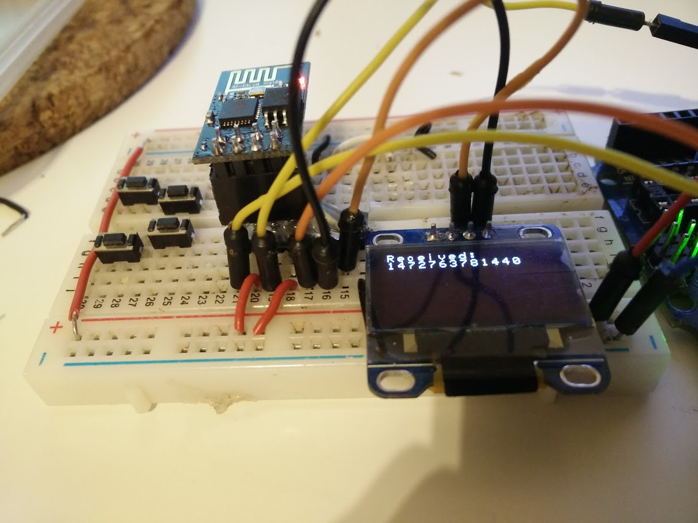

## ESP8266 OLED + Websocket



Combination of another ESP8266 projects:

* [ESP8266 OLED](https://hackaday.io/project/6132-esp8266oled)
* [ESP8266 Websocket](https://github.com/morrissinger/ESP8266-Websocket)
* [Arduino JSON](https://github.com/bblanchon/ArduinoJson)
* [Time](https://github.com/PaulStoffregen/Time)

## Dependencies

Copy ES8266-websocket, Arduino JSON and Time projects on
 `ARDUINO_PATH/Libraries`

## Run server

In NodeJS

```
cd websocket-server
npm install
node server.js
```
